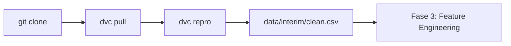

# Fase 2 — DVC (Data Version Control)

> Documentação da implementação do versionamento de dados e pipeline reproduzível com DVC.

---

## 1. O que foi implementado

A Fase 2 transforma o projeto de "notebooks + CSVs soltos" em um **pipeline de dados reproduzível**, onde:

- Os **dados brutos** são versionados pelo DVC (não vão para o Git)
- O **Git** guarda apenas ponteiros (`.dvc`) e o lockfile (`dvc.lock`)
- Um **stage `prepare`** valida e limpa os dados de forma automatizada
- Qualquer pessoa pode reproduzir o fluxo com `dvc pull && dvc repro`

```
data/raw/          ──DVC versiona──►  .dvc-storage/  (remote local)
     │
     ▼  stage: prepare
data/interim/      ──DVC rastreia──►  clean.csv, clean_test.csv, data_profile.json
```

---

## 2. Arquivos criados ou alterados

### Configuração DVC

| Arquivo | Função |
|---------|--------|
| `.dvc/` | Metadados internos do DVC |
| `.dvc/config` | Remote `localstorage` apontando para `.dvc-storage/` |
| `.dvcignore` | Arquivos ignorados pelo DVC (venv, checkpoints) |
| `dvc.yaml` | Definição do pipeline (stage `prepare`) |
| `dvc.lock` | Hash de dependências, parâmetros e outputs (reprodutibilidade) |
| `params.yaml` | Parâmetros versionados do pipeline |

### Ponteiros DVC (dados brutos)

| Arquivo | Dado versionado |
|---------|-----------------|
| `data/raw/train.csv.dvc` | Dataset de treino (1.460 linhas) |
| `data/raw/test.csv.dvc` | Dataset de teste |
| `data/raw/data_description.txt.dvc` | Descrição das colunas |
| `data/raw/.gitignore` | Gerado pelo DVC — impede CSVs no Git |

### Código Python

| Arquivo | Função |
|---------|--------|
| `src/data/validate_data.py` | Valida schema e qualidade dos dados brutos |
| `src/data/prepare_data.py` | Stage `prepare`: limpeza + perfil de dados |
| `src/utils/config.py` | Carrega `params.yaml` |
| `tests/test_data.py` | 6 testes automatizados do pipeline de dados |

### Outros

| Arquivo | Função |
|---------|--------|
| `.gitignore` | Atualizado para padrão DVC-friendly |
| `Makefile` | Atalhos: `make dvc-repro`, `make test`, etc. |
| `docs/FASE2_DVC.md` | Este documento |

---

## 3. Como o DVC funciona neste projeto

### 3.1 Git vs DVC — divisão de responsabilidades

| O que | Onde fica | Por quê |
|-------|-----------|---------|
| Código Python, configs | **Git** | Texto pequeno, diff legível |
| `train.csv`, `test.csv` | **DVC** | Arquivos grandes, mudam com frequência |
| `*.dvc` (ponteiros) | **Git** | Referência ao hash do arquivo no remote |
| `dvc.lock` | **Git** | Garante que `dvc repro` produz os mesmos outputs |

### 3.2 Remote storage

Configuramos um remote **local** para desenvolvimento:

```
url = .dvc-storage/   (relativo à raiz do projeto)
```

Os dados são copiados para `.dvc-storage/` com `dvc push` e recuperados com `dvc pull`.

> Em produção, o remote pode ser trocado para S3, Google Drive, Azure Blob, etc., sem mudar o pipeline.

### 3.3 Stage `prepare` — o que faz

O stage `prepare` executa `python -m src.data.prepare_data` e:

1. **Carrega** `train.csv` e `test.csv` de `data/raw/`
2. **Valida** schema (colunas obrigatórias, `SalePrice` positivo, sem IDs duplicados)
3. **Remove** coluna `Id` (não é feature preditiva)
4. **Remove** colunas com mais de 50% de missing values (configurável em `params.yaml`)
5. **Salva** outputs em `data/interim/`:
   - `clean.csv` — treino limpo (1.460 × 75)
   - `clean_test.csv` — teste limpo (292 × 74)
   - `data_profile.json` — métricas do processamento

### 3.4 Colunas removidas automaticamente

Com `missing_threshold: 0.5`, estas colunas foram descartadas por terem >50% de valores ausentes:

- `Alley`
- `MasVnrType`
- `PoolQC`
- `Fence`
- `MiscFeature`

Isso confirma um insight do EDA da Fase 1.

### 3.5 Parâmetros versionados (`params.yaml`)

```yaml
data:
  id_column: Id
  missing_threshold: 0.5      # remove colunas com >50% NA
  min_train_rows: 1000
  min_test_rows: 100
```

O DVC rastreia estes parâmetros no `dvc.lock`. Se você alterar `missing_threshold` e rodar `dvc repro`, o stage `prepare` será reexecutado automaticamente.

---

## 4. Comandos do dia a dia

### Reproduzir o pipeline inteiro

```powershell
cd "C:\Users\Luiz\Documents\LuizNazareth\MLOps and AIOps Projects\1-Foundation"
.\venv\Scripts\activate
dvc repro
```

### Baixar dados do remote (em máquina nova)

```powershell
git clone <seu-repo>
cd 1-Foundation
dvc pull
dvc repro
```

### Enviar dados para o remote

```powershell
dvc push
```

### Ver status do pipeline

```powershell
dvc status
dvc dag
```

### Rodar testes

```powershell
pytest tests/test_data.py -v
```

---

## 5. Fluxo de reprodutibilidade



**Garantia:** Se o código, os parâmetros e os dados brutos não mudarem, `dvc repro` produz exatamente os mesmos arquivos em `data/interim/` (mesmo hash MD5 registrado em `dvc.lock`).

---

## 6. Validação de dados (`validate_data.py`)

Antes de qualquer transformação, o pipeline verifica:

| Regra | Treino | Teste |
|-------|--------|-------|
| Mínimo de linhas | ≥ 1.000 | ≥ 100 |
| Colunas obrigatórias | `SalePrice`, `GrLivArea`, `OverallQual`, `YearBuilt`, `Neighborhood` | Features (sem target) |
| `SalePrice` sem NA e > 0 | Sim | N/A |
| `Id` sem duplicatas | Sim | — |

Se alguma regra falhar, o pipeline **interrompe** com erro claro — evitando treinar com dados corrompidos.

---

## 7. Perfil de dados (`data_profile.json`)

Exemplo gerado após `dvc repro`:

```json
{
  "train": {
    "rows": 1460,
    "columns": 75,
    "dropped_high_missing_columns": ["Alley", "MasVnrType", "PoolQC", "Fence", "MiscFeature"],
    "missing_columns": 14,
    "target_skewness": 1.88
  },
  "test": {
    "rows": 292,
    "columns": 74,
    "dropped_high_missing_columns": ["Alley", "MasVnrType", "PoolQC", "Fence", "MiscFeature"],
    "missing_columns": 13
  }
}
```

O `target_skewness: 1.88` reforça a decisão do EDA de aplicar `log(SalePrice)` na Fase 3.

---

## 8. Testes automatizados

6 testes em `tests/test_data.py`:

- Validação de treino com dados corretos
- Falha quando `SalePrice` está ausente
- Validação do conjunto de teste
- Remoção de colunas com alto missing
- Remoção da coluna `Id`
- Geração do `data_profile.json`

```powershell
pytest tests/test_data.py -v
# 6 passed
```

---

## 9. O que commitar no Git

Após a Fase 2, estes arquivos devem ir para o Git:

```
.dvc/
.dvcignore
dvc.yaml
dvc.lock
params.yaml
data/raw/*.dvc
data/raw/.gitignore
src/data/validate_data.py
src/data/prepare_data.py
src/utils/config.py
tests/test_data.py
docs/FASE2_DVC.md
.gitignore (atualizado)
Makefile
```

**Não commitar:** `data/raw/*.csv`, `data/interim/*.csv`, `.dvc-storage/`

---

## 10. Próxima fase

Com `data/interim/clean.csv` pronto, a **Fase 3 — Feature Engineering** vai:

1. Adicionar stage `featurize` ao `dvc.yaml`
2. Imputar missing values restantes
3. Criar features derivadas (`Age`, `TotalSF`, etc.)
4. Encoding categórico + scaling
5. Salvar `data/processed/X_train.csv`, `y_train.csv`, etc.

---

## 11. Troubleshooting

| Problema | Solução |
|----------|---------|
| `ModuleNotFoundError: No module named 'src'` | Use `python -m src.data.prepare_data` (já configurado no `dvc.yaml`) |
| `File not found: train.csv` | Rode `python scripts/download_data.py` ou `dvc pull` |
| `dvc repro` não reexecuta | Altere um parâmetro em `params.yaml` ou use `dvc repro -f` |
| Dados desatualizados no remote | `dvc add data/raw/train.csv` + `dvc push` após atualizar CSVs |

---

> **Fase 2 concluída.** O projeto agora tem versionamento de dados e pipeline reproduzível — requisito profissional para qualquer sistema MLOps.
